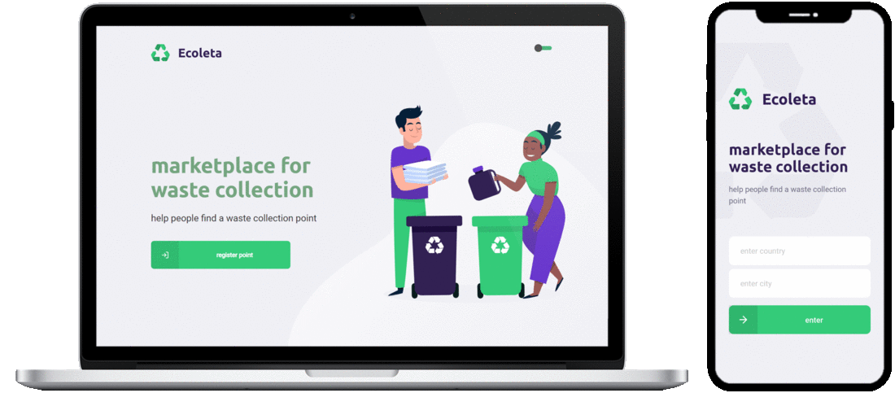

# Ecoleta

Ecoleta is a platform to help people finding waste collections points nearly their location. They can find all types of items that the collection points are able to take. The registry of the waste collection points can be managed in the web interface by each entity. The search for waste collection points, in a specific location and for different types of items, can be made in the mobile interface.

This project was developed using **Node.js** to *Backend Server*, **React** to *Frontend Web*, and **React Native** to *Frontend Mobile*. Also used: **TypeScript**, **SQLite**, **knex.js**, **Multer**, **celebrate**, **styled components**, **Expo** and more.

## Prerequirements

### Node.js

Install the latest stable version (LTS - Long Term Support) of [**Node.js**](https://www.nodejs.org/en/download/package-manager/).

Execute the command `node -v` to check if is already installed.

### Expo-CLI (or Android/iOS Emulator)

To test the use of the mobile interface you need an emulator of Android/iOS system, or you can use [**Expo-CLI**](https://www.docs.expo.io/workflow/expo-cli/).

In case of using **Expo-CLI**, you also need to install [**Expo**](https://www.play.google.com/store/apps/details?id=host.exp.exponent&hl=en) app in the Android mobile device or [**Expo Client**](https://apps.apple.com/us/app/expo-client/id982107779) app in the iOS mobile device.

## Install

The project have tree main directories: `server`, `web` and `mobile`.

To install all the packages you need to run `npm install` inside each directory.

## Configuration

* *(Required)* - Create **SQLite** database and populate *items* table: 
    * `npm run knex:migrate`
    * `npm run knex:seed`
* *(Required)* - Edit the file `./src/config/config.json` in all tree directories (`server`, `web`, `mobile`):
    * *"HOST_SERVER": "**\<HOST_SERVER\>**"*
    * *"PORT_SERVER": "**\<PORT_SERVER\>**"*
* *(Optional)* - If you need to configure a different port for the *Frontend Web*, edit the file `./web/package.json`:
    * *{ ...,  "scripts": { "start": "set PORT=**\<PORT\>** && ...", ...}, ...}*

## Run

To execute the *Backend Server* and use the API, run `npm start` or `npm run dev`. 

To execute the *Frontend Web* and use the web interface, run `npm start`. Wait for opnening a tab in the browser with the interface.

To execute the *Frontend Mobile* and use the mobile interface, run `npm start`. Wait for opening a tab in the browser with a *QR code*, that you need to scan with your mobile device, using the **Expo** app. You also need to be connected to the same network, in both devices.

> **NOTES:**
> * The *Frontend Web* and *Frontend Mobile* depend on the *Backend Server* to execute operations that need access to the datatbase, and will show some errors if you try to done some of those operations without the *Backend Server* running.
> * When the **Expo-CLI** start running and connecting with the mobile device, if you get some error like: *Error: ENOSPC: System limit for number of file watchers reached*, try this [solution](https://github.com/guard/listen/wiki/Increasing-the-amount-of-inotify-watchers#the-technical-details
).
> * If you are using *Windows* and run into problems connecting the **Explo** app in mobile device with the running **Expo-CLI**, try to turn off the *Windows Firewall* for your private network.

## Usage

### Backend Server

Once you run the *Backend Server*, you can start using and sending request, directly through the API.

| Method | URL     | Headers | Query Params         | Route Params | Body                                                                        |
| ------ | ------- | ------- | -------------------- | ------------ | --------------------------------------------------------------------------- |
| GET    | /items  |         |                      |              |                                                                             |
| GET    | /points |         |                      | id           |                                                                             |
| GET    | /points |         | country, city, items |              |                                                                             |
| POST   | /points |         |                      |              | { name, email, whatsapp, latitude, longitude, country, city, items, image } |

### Frontend Web

With the *Backend Server* running, and the *Frontend Web* also up, you see the interface in your browser. Now you can register a new waste collection point, with all the information, including the exact positoin on the map, and the types of items that you intend to collect.

### Frontend Mobile

After scan the *QR code* in your mobile device, and again, with the *Backend Server* running, you will be able to see the interface of the *Frontend Mobile*. Now you can choose your country and city, to filter the points nearly your position. After select the type of items that you intend to get rid of, you can see in the map all the available collection points. For each point you can see the details and see more information. Adicionaly, you can contact via *e-mail* or *WhatsApp*.

## Acknowledgments

I developed part of this project during the [Next Level Week 1 - Booster](https://github.com/Rocketseat/nlw-01-booster) (by [Rockeseat](https://www.rocketseat.com.br/) and [Diego Fernandes](https://www.github.com/diego3g)).

## License

This project is licensed under the MIT License - see the [LICENSE.md](LICENSE.md) file for details.
